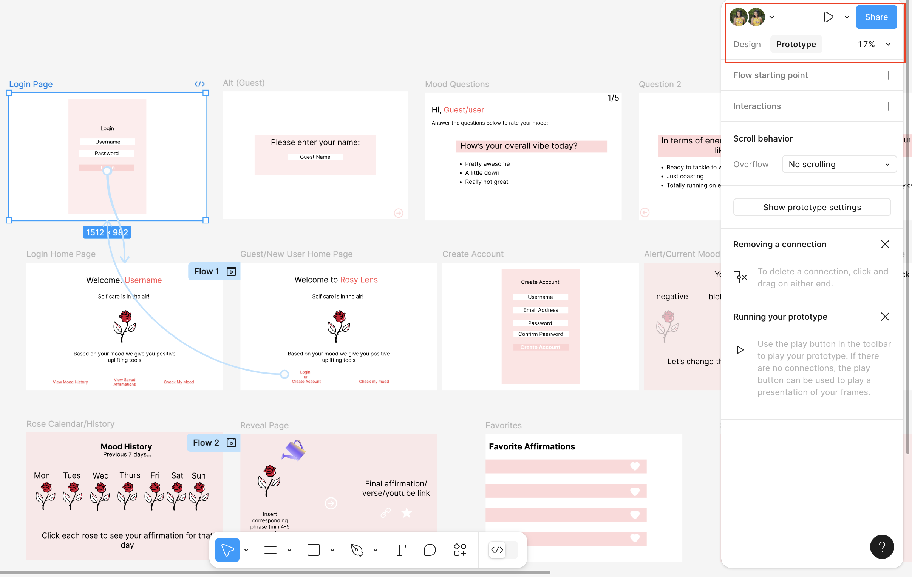
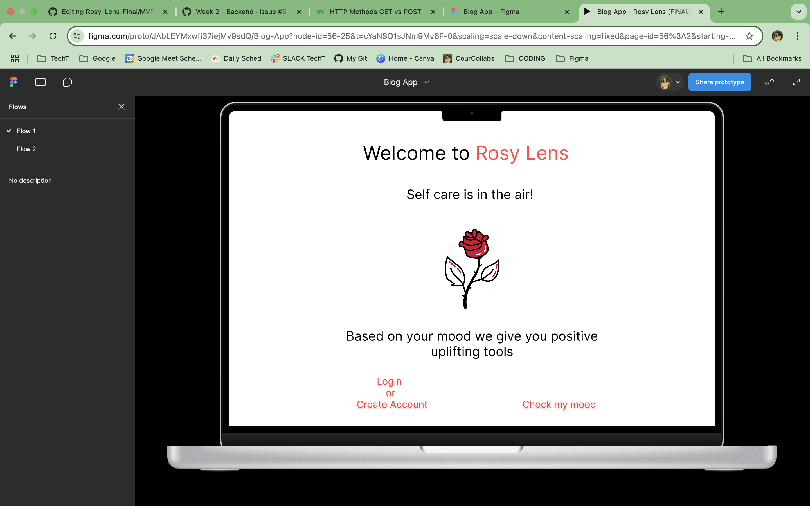

# ROSY LENS 🌹 🥀

Rosy Lens uplifts people with positive affirmations who need a boost of happiness and encouragement (with the option to link to music or a bible verse).

## MVP 
The app visually represents the user's potential mood through a rose that either strengthens in vibrancy or wilts. Based on a mood assessment, the user "waters" the rose (engaging interaction) to reveal a personalized affirmation, song snippet, or bible verse, reflecting a moment of self-care.

### Features
- <u>Mood reader</u> (gauges your mood from list of 3-5 questions)
- <u>Positive deliverable</u> (provides affirmation, song or bible verse based on user input/responses)
- <u>Rose visual</u> (animation that changes vibrancy/health based on initial mood selection)
- <u>Watering interaction</u> (User selects which deliverable they would like to receive and this is the big reveal)
- <u>Rose animation</u> (e.g., color subtly changing to more vibrant/healthy) and display of affirmation 
- <u>Exiting slogan</u> an option to return to home, share link,or save the affirmation

Access my [wireframe and user flow](https://www.figma.com/design/JAbLEYMxwfi37iejMv9sdQ/Blog-App?node-id=56-2&p=f&t=cYaNSO1sJNm9Mv6F-0) directly on Figma for a closer look.
What you can expect to see:

Select prototype tab then click the frame to highlight the user flow 

You can also click the play button and it will simulate the user flow as if it were on a laptop

**Tools/Frameworks Needed**
- YouTube API 
- Bible Verse API
- React, CSS, Express, Node, and PostgreSQL

**Nice to haves**
- YouTube API (for both music/visually calming imagery)
- Imagery that turns bible verse or song title into a cute post to share (their mood/affirmation on other social platforms)
- User Management (forgot password verification, change username option)

**Technical Risks**
- API misreading the user input/mood and providing the wrong affirmation
- Generating the wrong type of bible verse that is not accurately correlated to the user’s mood