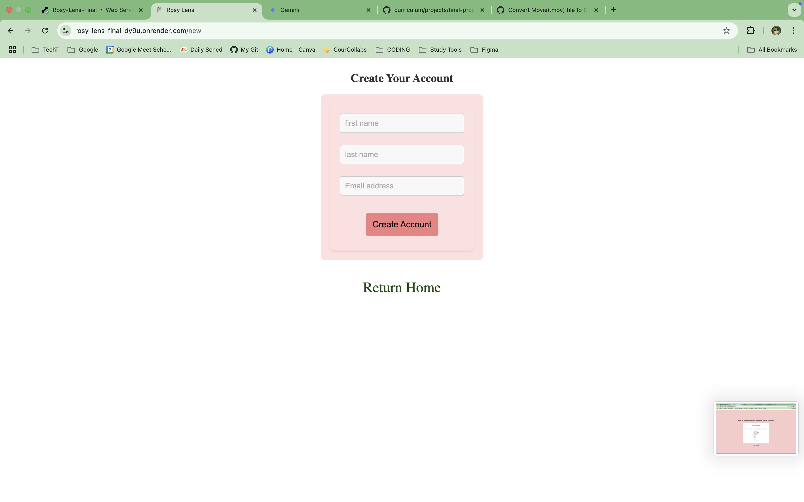

# ROSY LENS 🥀 🌹 

**Rosy Lens uplifts people who need a boost of happiness and encouragement with a positive affirmation, bible verse, or peaceful lofi song.**

## Table of Contents
- [Prerequisites](#what-youll-need)
- [Installation Instructions](#installation-instructions)
- [Features](#features)
- [Demo](#demo)
- [Upcoming Additions](#future-goals)
- [FAQs](#faqs)
- [Contribute](#have-an-idea-you-want-to-contribute)

# What You'll Need 
Prior to running this project, here are the pre-reqs you'll need. Please make sure you've got these installed on your computer:

* **Node.js:** This runs the app (you'll want version 16 or later)
* **npm** Node Package Manager
* **PostgreSQL** This is where we'll keep all our user's mood data. Make sure it's up and running! Mock data is provided in my db.sql file to get you started ✅
* **Vitest** For running unit tests _(cd into client and use the command **npm test** to run test files)_

# Installation Instructions
Below is a step-by-step to run my project locally ⭐️

## Part One

**1. Clone my repo**
```bash
git clone https://github.com/courjimen/Rosy-Lens-Final.git
```

**2. Install dependencies in directories**

Cd into client and run the following commands:
```bash
npm install -D vitest jest babel-jest @babel/preset-env @babel/preset-react @testing-library/react @testing-library/jest-dom react-router-dom @react-oauth/google@latest @mui/material @emotion/react @emotion/styled @fortawesome/react-fontawesome @fortawesome/free-solid-svg-icons dotenv
```
<br/>

Cd into server and run the following command:
```bash
npm install pg cors express nodemon node-fetch && npm init -y
```

Return to the root directory and run this command:
```bash
npm init -y && npm install concurrently
```

## Part Two 

**3. Set up database**

You'll need to use `psql` to create your tables locally. Sign in _(make sure postgres is installed!)_ with the following command:

```bash
psql postgres
```

Next, cd into server and follow the steps in my `db.sql` file. Copy/paste the code into your terminal.

**4. Insert database credentials** 

Cd into server and open `db.js` and input your database connection details (username, password, etc.) _**use `/conninfo` to find your database credentials if you are unsure**_

**5. Let's run it**

Now we're ready to run the app! Navigate back into the root directory and run the following:

```bash
npm run dev
```
This will start both the server and the client. You should be able to see the app in your browser at `http://localhost:5173/` while the server will be running on `http://localhost:3000/`.

# Key Features
- **Mood reader** gauges your mood from list of 3-5 questions
- **Positive deliverable** provides affirmation, *song or bible verse based on user input/responses
- **Rose visual** animation that changes vibrancy/health based on initial mood selection
- ***Watering interaction** User selects which deliverable they would like to receive and this is the big reveal
- ***Rose animation** e.g., rose subtly changing from wilted to vibrant/healthy
- **Shareable Card** an option to share link or visual snippet to social media platforms

*<u>Nice to haves:</u> Upcoming features that will be implemented at a later date

# Demo
We will be updating with visuals of the app soon! In the meantime, you're able to [checkout my wireframe]((https://www.figma.com/design/JAbLEYMxwfi37iejMv9sdQ/Blog-App?node-id=56-2&p=f&t=cYaNSO1sJNm9Mv6F-0)) directly on Figma.

What you can expect to see:


Demo of Rosy Lens (MVP): 
### Here's what you can expect to see for the main home page


### You can choose to login with Google or as a Guest this is where each link will take you to the respective pages
| Login Page | Guest Page |
| ------ | ------|
|  | 

### Moving as a logged in user this will be your home page:


### You will take your quiz:


### After you'll receive a score and depending on how high or low it will return a corresponding rose and phrase:
| Positive | Negative |
| ------ | ------|
|  |  | 

### Once you click pick an affirmation you'll got to the selection page:


### You'll be able to select either an affirmation or bible verse:
| Select Affirmation | Affirmation | Bible Verse |
| ------ | ------| ------|
|  |  |  |

### You will have the option (as a logged in user) to save your favorite items:
| Favorite Alert | Favorite List |
| ------ | ------|
|  |  |

### Finally for the guest flow, after entering your name you'll also take the quiz and have the option to create an account to view affirmations:
| Guest Quiz Score | Create Account Form|
| ------ | ------|
|  | 


# FAQs
**Q: Am I able to see affirmations as a guest?**

A: No, as of now that feature is only available to logged in users who create account.

**Q: Can I make suggestions for affirmations or verses to add to the platform?**

A: Absolutely! You can check out our [contribution guidelines](#have-an-idea-you-would-like-to-contribute) below

# Future Goals
We are continuously working on improving and expanding the functionality of Rosy Lens to provide the best user experience for you! Here are some exciting upcoming features we plan to implement in the future: 

| <u>Feature<u/>                                      | <u>Description<u/>                                                                                  |
| -------------------------------------------- | -------------------------------------------------------------------------------------------- |
| **Youtube Videos**            | Add lofi songs with calming visuals as a deliverable                                                               |
| **Sharing Capabilities** | Share your affirmations or songs on social platforms                                    |
| **Translation Options**                  | Access the Rosy Lens in different languages                                        |

# Have an idea you would like to contribute?
We love positive contributions to enhance and expand Rosy Lens. To submit suggestions please open an issue on our GitHub repository. Feel free to submit a pull request as well! A contributing guide is under development ⚠️